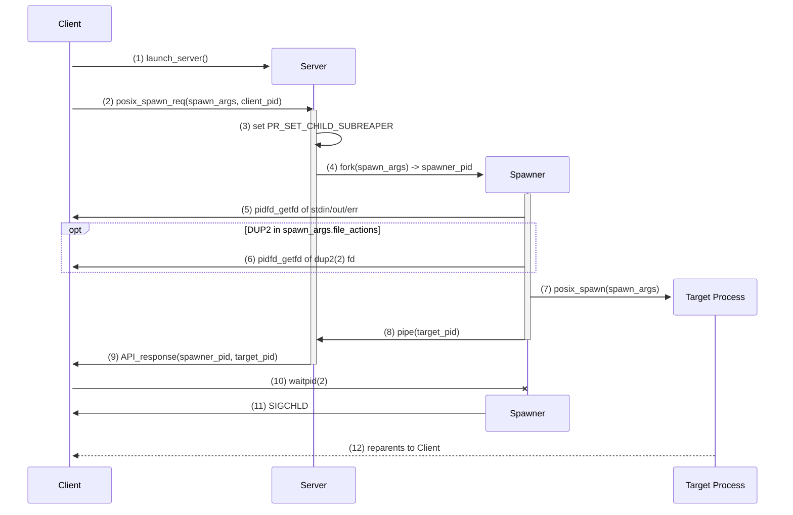

# Spawn Server

This Rust library permits to execute programs without replying on `fork`. This crate exports macros `srpc!` (synchronous) and `arpc!` (asynchronous) that is similar to macro `sh!`. Have a look in the examples directory on how to use this macro.

## Usage

Use macro `srpc!` to send requests to the spawn server. This is a synchronous call. For asynchronous calls, use macro `arpc!`. Import these macros in your Rust program as follows:

```rust
use spawn_server::{arpc, srpc};
```

Also, add the following to your `Cargo.toml` file:

```toml
[dependencies]
spawn_server = { version="*", git = "https://github.com/scontain/spawn_server.git" }
```

## Deployment

You should run the spawn server in the same container as the program that uses the spawn server. The spawn server will - for now - use port 8099.

## Build

Just execute `cargo build --release` to build the spawn server. 

## `posix_spawn(2)` mode

The spawn server allows the execution of `posix_spawn(2)` in the stead of a requesting client.
In particular, this substitute `posix_spawn(2)` aims to be a 
The client thereby sends a request to the API of this server, wherein the request contains the arguments to the `posix_spawn(2)` syscall.
The server then executes this syscall, and reparents the spawned process to the client.

The corresponding code, as well as a test in `mod.rs` showing the server's usage, can be found [here](./src/spawn).


### Architecture

The following sequence diagram illustrates how the spawn_server components interact with each other.


As the diagram shows:
1. The client launches, i.e., forks, the server.
   The server must thereby be a child of the client, as otherwise, the spawned processes cannot be reparented to the client.
   In particular, the client requires the reparenting to `waitpid(2)` for the spawned process.
2. The client may then issue a `posix_spawn` request to the server. The client thereby specifies the calling arguments to `posix_spawn(2)`, excluding `pid`; it receives the value thereof in the function call's return value.
   Further, the client sets its own `pid` and whether to use `posix_spawn` or `posix_spawnp` in the request's body.
   The server uses the client's `pid` to retrieve relevant file descriptors via `pidfd_getfd`.
   Moreover, `posix_spawn` uses a path to find the to-be-executed binary, while `posix_spawnp` searches the local PATH for a supplied binary file name.
3. Upon receiving a request, the server sets the `PR_SET_CHILD_SUBREAPER(2const)` attribute. This attribute allows the server to reparent its spawned processes to the parent, in particular, the target `posix_spawn`ed process.
   As the subreaper attribute only reparents the child process to the subreaper upon the termination of the child's parent, the server uses a separate spawner process to facilitate the reparenting of the target process to the client without terminating the server.
4. The server thereupon forks this spawner process, supplying this new process with the server's received client posix_spawn args in addition to a pipe to communicate the final posix_spawn process PID back to the server. The server thereby retains the PID of the spawner to `wait` for this process later.
5. To emulate `posix_spawn(2)` correctly, the spawner initially `pidfd_getfd(2)` and dups the client's stdin/out/err.
   It thereby assigns the client's fd numbers the same values as on the client, i.e., to 0, 1, 2, and as such, must dup and close its own std/in/out/err.
   This replacement of file descriptors allows the `posix_spawn`ed process to use the client's stdin/out/err, if not specified otherwise.
6. The spawner process must also take care of the `posix_spawn.file_actions` argument to emulate the syscall correctly. For the close operation, the spawner can simply ignore the operation, as it does not have the to-be-closed file descriptor open.
   For the open operation, the spawner may ignore this operation as well; the `posix_spawn` can simply open the supplied file path.
   Finally, for the dup2 operation, the spawner must indeed retrieve the corresponding source file descriptor from the client.
   Thereupon, the spawner dups the file descriptor, as specified per the argument.
7. Finally the spawner calls the `posix_spawn` syscall with the client-supplied arguemnts and emulated environment.
   The spawner writes the corresponding created pid into the pipe shared with the server, whiich the server subsequently reads (8)
9. The server returns the spawner and target process PID to the client. NOTE the server could also wait for the spawner to finish.
10. The client first `wait`s for the process spawner to finish. This `wait` ensures that the target spawned process is reparented to the client. Again, this could also be done by the server itself.
11. Accordingly, the spawner sends the SIGCHLD signal to the waiting client; the spawner terminates after sending the target process pid to the server.
12. Finally, the targer process reparents to the subreaper, which is the client.
    As such, the client may `waitpid` for this process to terminate.
